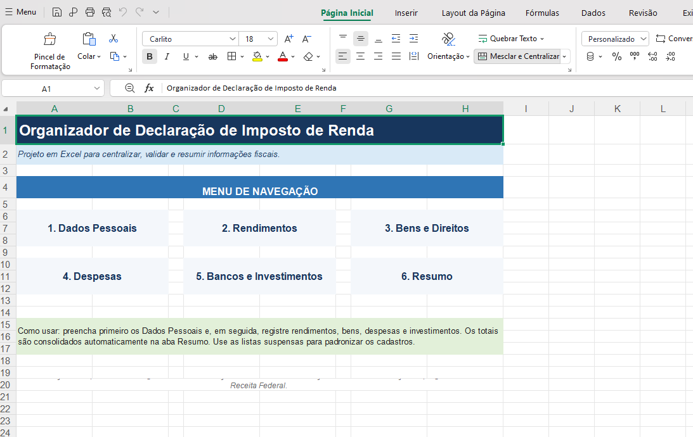
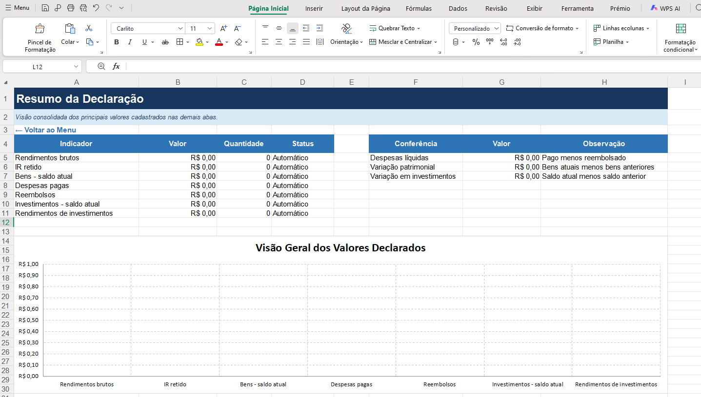

# 📊 Organizador de Declaração de Imposto de Renda

## 📌 Sobre o Projeto

Este projeto foi desenvolvido como parte de um desafio prático da DIO, com o objetivo de criar uma ferramenta em Excel para auxiliar na organização das informações necessárias para a declaração de Imposto de Renda.

A solução centraliza dados pessoais, rendimentos, bens, despesas, contas bancárias e investimentos, proporcionando uma visualização mais organizada das informações.

## 🎯 Objetivo

Aplicar na prática recursos do Microsoft Excel para desenvolver uma ferramenta funcional, organizada e de fácil utilização.

Além da construção da planilha, o projeto também tem como objetivo desenvolver habilidades de documentação e organização de projetos para portfólio.

## 🛠️ Tecnologias e Recursos Utilizados

- Microsoft Excel
- Fórmulas e funções
- Validação de dados
- Listas suspensas
- Formatação condicional
- Navegação entre planilhas
- Organização e consolidação de dados
- Gráficos
- GitHub para documentação do projeto

## 📂 Estrutura da Planilha

### 🏠 Menu
Página inicial para facilitar a navegação entre as áreas da ferramenta.

### 👤 Dados Pessoais
Área destinada ao cadastro das principais informações do contribuinte.

### 💰 Rendimentos
Controle das fontes pagadoras, valores recebidos e imposto de renda retido.

### 🏡 Bens e Direitos
Registro de imóveis, veículos, investimentos e outros bens.

### 🧾 Despesas
Organização de despesas, incluindo gastos que podem ser relevantes para a declaração.

### 🏦 Bancos e Investimentos
Controle das instituições financeiras, contas e investimentos.

### 📊 Resumo
Consolidação automática das principais informações cadastradas na planilha.

## ✨ Funcionalidades

- Centralização das informações em um único arquivo
- Campos padronizados por meio de validação de dados
- Listas suspensas para facilitar o preenchimento
- Cálculos e consolidações automáticas
- Controle de documentos e comprovantes
- Navegação simplificada entre as abas
- Resumo visual das informações cadastradas
- Interface organizada e de fácil utilização

## 🚀 Como Utilizar

1. Faça o download do arquivo Excel.
2. Abra o arquivo no Microsoft Excel.
3. Comece preenchendo a aba **Dados Pessoais**.
4. Cadastre seus rendimentos, bens, despesas e informações financeiras.
5. Utilize a aba **Resumo** para acompanhar os valores consolidados.

## 📚 Aprendizados

Durante o desenvolvimento deste projeto, foi possível colocar em prática conhecimentos relacionados à organização e tratamento de dados no Excel, utilização de validações, fórmulas, formatação e construção de uma interface mais amigável.

O projeto também contribuiu para desenvolver uma visão mais prática sobre como o Excel pode ser utilizado para transformar dados em informações organizadas e úteis para tomada de decisão.
## 🖼️ Imagens do Projeto

### 🏠 Menu Principal

### 📊 Resumo das Informações

## ⚠️ Observação

Esta ferramenta possui finalidade educacional e organizacional e não substitui sistemas oficiais, profissionais de contabilidade ou orientações da Receita Federal.

## 👨‍💻 Autor

Desenvolvido por **Thiago Saburido** como projeto de portfólio durante os estudos na DIO.
